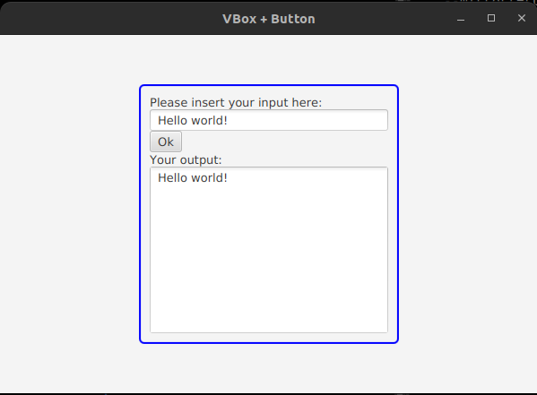

# Interfaces-UF2

## Tarea:
Realizar el tutorial del siguiente link para conseguir el TextAreaExample que muestre la ventana donde pide el texto y con el botón Ok devuelve el texto:

[http://examples.javacodegeeks.com/desktop-java/javafx/scene/javafx-scene-builder-tutorial/Enlaces](http://examples.javacodegeeks.com/desktop-java/javafx/scene/javafx-scene-builder-tutorial/Enlaces) a un sitio externo.

Entregar un fichero con una pantalla en que se vea que se ejecuta la aplicación , se mete el texto en el interface javafx y lo devuelve. Alternativamente entregar un link a github con el proyecto y los ficheros de Oracle Java Fx